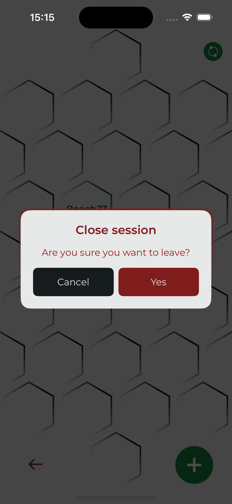

# Sockets
A sample app about WebSocket Messaging and Encryption

Connect to any server and start messaging, don't worry your messages are all encrypted ;)

# Samples
Dark

  

Light

  

# Resources Disclaimer
All the icons used in the App are of free use, here's the credit for the creators:

[Those Icons](https://www.flaticon.es/autores/those-icons)

  

[SmashIcons](https://www.flaticon.es/autores/smashicons)

  

[iconading](https://www.flaticon.es/autores/iconading)

  

[SumberRejeki](https://www.flaticon.es/autores/sumberrejeki)

  

